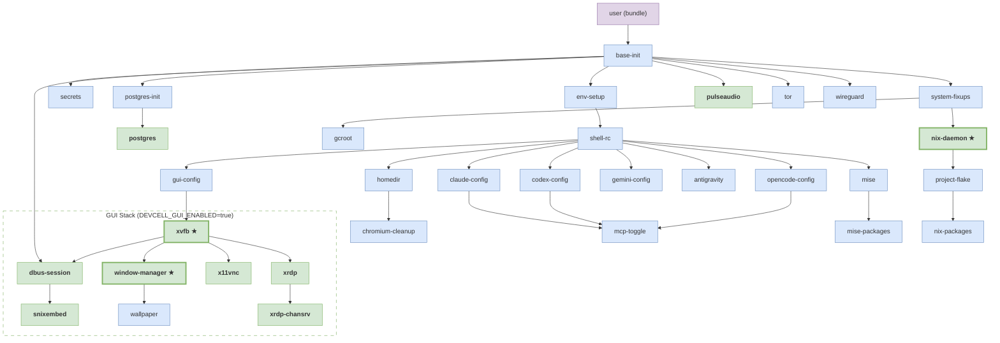

# s6-rc Service Topology

34 services managed by s6-rc. Dependencies resolved in parallel with readiness gating.

## Dependency Graph

> Blue = oneshot, green = longrun, purple = bundle, **★** = notification-fd=3 (readiness-gated).

## Services

| Service | Type | Platform | Readiness | Notes |
|---------|------|----------|-----------|-------|
| **base-init** | oneshot | all | | `linux/up`, `darwin/up` variants |
| **env-setup** | oneshot | Linux, WinKit | | writes `/etc/s6/env/` |
| **secrets** | oneshot | all | | |
| **postgres-init** | oneshot | all | | |
| **system-fixups** | oneshot | all | | `linux/up`, `darwin/up` variants |
| **pulseaudio** | longrun | Linux, WinKit | | |
| **tor** | oneshot | all | | |
| **wireguard** | oneshot | all | | |
| **shell-rc** | oneshot | all | | |
| **postgres** | longrun | all | | |
| **gcroot** | oneshot | all | | |
| **nix-daemon** | longrun | all | notification-fd=3 | |
| **homedir** | oneshot | all | | |
| **gui-config** | oneshot | all | | |
| **claude-config** | oneshot | all | | |
| **codex-config** | oneshot | all | | |
| **opencode-config** | oneshot | all | | |
| **gemini-config** | oneshot | all | | |
| **antigravity** | oneshot | all | | |
| **mise** | oneshot | all | | |
| **project-flake** | oneshot | all | | |
| **chromium-cleanup** | oneshot | all | | |
| **mcp-toggle** | oneshot | all | | |
| **mise-packages** | oneshot | all | | |
| **nix-packages** | oneshot | all | | |
| **xvfb** | longrun | Linux, WinKit | notification-fd=3 | `:99` |
| **dbus-session** | longrun | Linux, WinKit | | writes `DBUS_SESSION_BUS_ADDRESS` to envdir |
| **window-manager** | longrun | Linux, WinKit | notification-fd=3 | check: `xdotool search --class` |
| **snixembed** | longrun | Linux, WinKit | | reads envdir for `DBUS_SESSION_BUS_ADDRESS` |
| **x11vnc** | longrun | Linux, WinKit | | `:5900` |
| **xrdp** | longrun | Linux, WinKit | | `:3389` |
| **xrdp-chansrv** | longrun | Linux, WinKit | | |
| **wallpaper** | oneshot | Linux, WinKit | | |
| **user** | bundle | all | | `contents.d/` lists all services |

## How It Works

- **Build time**: `s6-rc-compile` (via `s6-linux-renderer.nix`) compiles source definitions from `modules/s6/` into `/etc/s6-rc/compiled/`.
- **Boot time**: entrypoint starts `s6-svscan`, runs `s6-rc-init` to link the compiled DB, then `s6-rc -u change user` brings up all services in parallel dependency order.
- **Privilege model**: s6-svscan runs as root. Services drop to session user via `gosu` in their run scripts. `chmod 0711` on supervise directories lets the session user query status with `s6-svstat`.
- **Envdir** (`/etc/s6/env/`): oneshots write env vars (e.g. `DBUS_SESSION_BUS_ADDRESS`), longruns read them via `s6-envdir`.
- **Dependencies**: declared via `dependencies.d/` directories containing empty files named after deps.

## Known Issues

1. **Compiled DB missing log pipelines** (MEDIUM): per-service s6-log definitions exist in source but aren't in the compiled output. Service stdout goes to the svscan catchall log.
2. **Oneshot up scripts use shell** (LOW): s6-rc-compile expects execline. The community-home compiler wraps them, but pure s6-rc-compile would reject.
3. **xrdp.log root-only** (LOW): session user can't read connection logs. Fixed by #1.
